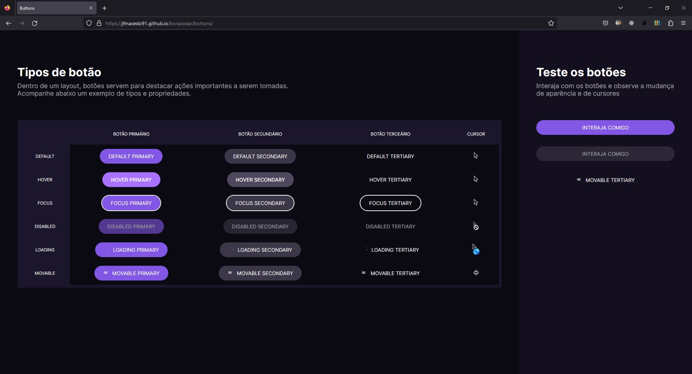

# Desafio 3 - Botões e Cursores

  
  
  
  

## Imagem

## Tecnologias

Esse projeto foi desenvolvido com as seguintes tecnologias:

- HTML e CSS
- Git e Github
- Figma

## Layout do projeto

 - [FIGMA](https://www.figma.com/community/file/1197534710257750520)

## Autor

